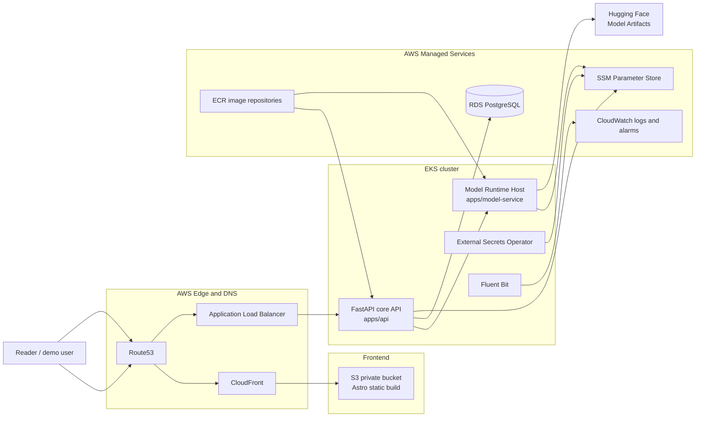
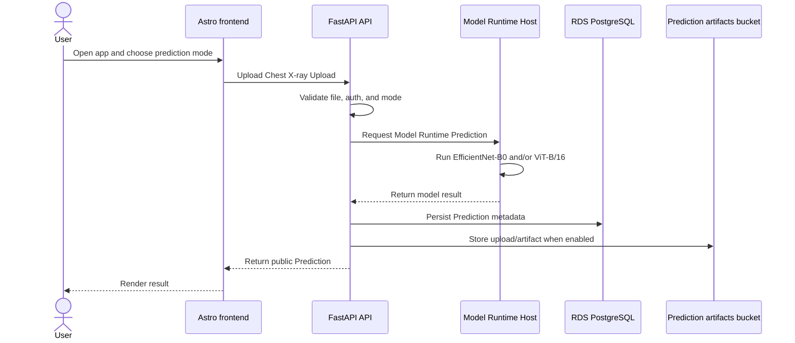
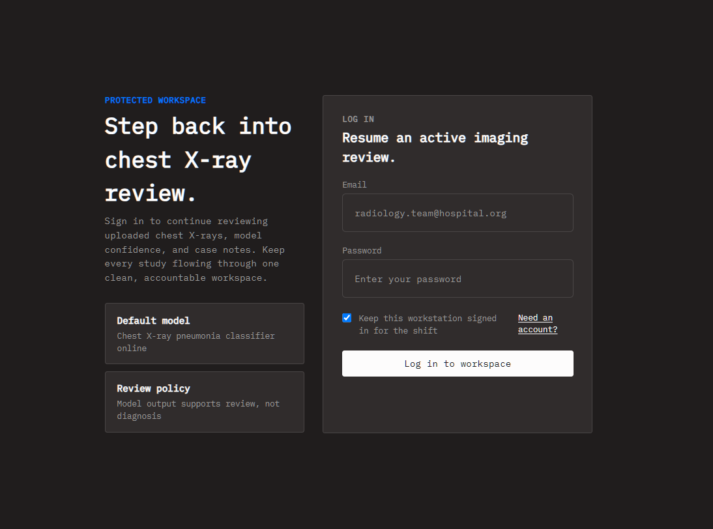
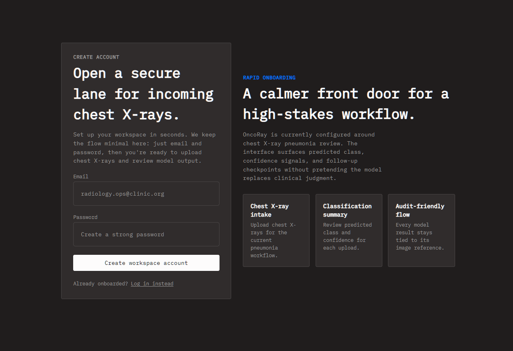
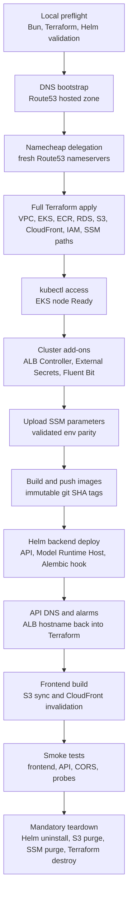

# OncoRay PyTorch Model Monorepo 🩻

Production-style ML application monorepo for chest X-ray pneumonia screening. It combines an Astro frontend, FastAPI API, PyTorch Model Runtime Host, Terraform-managed AWS infrastructure, and Helm-managed Kubernetes workloads.

Built as a full-stack ML systems portfolio project: model training, inference serving, auth, API contracts, cloud deployment, observability, teardown discipline, and enough runbooks to make future-you slightly less angry. 😄

Because this is an educational project, the cloud architecture is intentionally overboard. A small demo could run on something much simpler, but this repo deliberately uses a broad slice of AWS so the project can exercise real production building blocks instead of stopping at "Docker on localhost, vibes in production."

> **Safety note:** this repository is a showcase and education project. It is not a medical device and must not be used for clinical decisions.

## Why This Repo Is Interesting 🚀

| Signal | What it shows |
| ------ | ------------- |
| Product flow | Login, registration, model selection, Chest X-ray Upload, and Prediction result UI |
| ML engineering | EfficientNet-B0 and ViT-B/16 classifiers served from exported Model Artifacts |
| Backend depth | FastAPI, auth, PostgreSQL, Alembic, health probes, and Prediction Orchestration |
| Platform work | EKS, Helm, Terraform, RDS, S3, CloudFront, Route53, ACM, ALB, SSM, and CloudWatch |
| Ops maturity | Repeatable deploy/destroy flow, smoke tests, safety checklist, and documented failures |
| Recruiter translation | Not "I trained a notebook once"; more "I shipped the boring parts too." |

## Status

| Area                           | Current state                                                                                           |
| ------------------------------ | ------------------------------------------------------------------------------------------------------- |
| AWS prototype                  | Deployed twice on 2026-05-03, smoke-tested, then torn down twice                                        |
| Target domain                  | `oncoray.online`, `app.oncoray.online`, `api.oncoray.online`                                            |
| AWS account used for prototype | `123456789012`                                                                                          |
| AWS region                     | `eu-central-1`                                                                                          |
| Frontend                       | Astro static site in private S3 behind CloudFront                                                       |
| API                            | FastAPI on EKS behind ALB                                                                               |
| Model serving                  | `apps/model-service` as one internal Model Runtime Host on EKS                                          |
| Database                       | Amazon RDS for PostgreSQL                                                                               |
| Infrastructure                 | Terraform for AWS, Helm for Kubernetes                                                                  |
| Secrets                        | AWS SSM Parameter Store synced by External Secrets Operator                                             |
| Teardown                       | `bun run prod:destroy` removes prototype resources; KMS keys remain in AWS `PendingDeletion` for 7 days |

## Contents

- [Why This Repo Is Interesting](#why-this-repo-is-interesting-)
- [Architecture](#architecture)
- [Product Preview](#product-preview-)
- [Repository Map](#repository-map)
- [Domain Model](#domain-model)
- [Technology Stack](#technology-stack)
- [Model Training and Artifacts](#model-training-and-artifacts)
- [AWS Deployment Flow](#aws-deployment-flow)
- [Deployment Command Reference](#deployment-command-reference)
- [Local Validation](#local-validation)
- [Deployment Runbook](#deployment-runbook)
- [Teardown](#teardown)
- [Operational Lessons](#operational-lessons)
- [Canonical Docs](#canonical-docs)

## Architecture



### Prediction Flow



## Product Preview ✨

Public-safe screenshots live in [`demo/`](demo).

### Authentication

| Login | Register |
| ----- | -------- |
|  |  |

## Repository Map

```text
apps/
  api/              FastAPI backend, auth, DB, Alembic, health probes, Prediction Orchestration
  astro-web/        Astro frontend and Prediction Workflow
  model-service/    Model Runtime Host for PyTorch inference
  pytorch-engine/   training notebooks, model builders, experimentation code

packages/
  ui/                shared frontend UI package
  eslint-config/     shared lint config
  tailwind-config/   shared Tailwind config
  typescript-config/ shared TypeScript config

infra/
  terraform/         AWS infrastructure modules and prod environment
  helm/              backend-stack and platform-addons charts
  scripts/           validation, deploy, add-on, SSM, rollback, teardown helpers

docs/
  PRD.md                       production requirements and status
  DEPLOYMENT_COMMAND_REFERENCE.md
  DEPLOYMENT_RUNBOOK.md
  adr/
```

## Domain Model

This repo uses the language from [CONTEXT.md](CONTEXT.md).

| Term                     | Meaning                                                                                         |
| ------------------------ | ----------------------------------------------------------------------------------------------- |
| Prediction               | Public API classification result for one uploaded chest X-ray                                   |
| Chest X-ray Upload       | Uploaded PNG, JPG, or WEBP image before scoring                                                 |
| Prediction Orchestration | API-owned workflow that validates input, calls Model Runtimes, and builds the public Prediction |
| Prediction Workflow      | Frontend-owned flow for model selection, upload, request, and result presentation               |
| Model Runtime            | Deployed classifier that can score one image for one model slug                                 |
| Model Runtime Host       | HTTP process exposing one or more Model Runtimes                                                |
| Model Artifact           | Trained weights loaded by a Model Runtime                                                       |
| Model Catalog            | Read-only API metadata for available Model Runtimes                                             |

## Technology Stack

| Layer              | Tools                                                                        |
| ------------------ | ---------------------------------------------------------------------------- |
| Monorepo           | Turborepo, Bun workspaces                                                    |
| Frontend           | Astro, TypeScript, Tailwind                                                  |
| API                | FastAPI, Python, Alembic, PostgreSQL                                         |
| ML runtime         | PyTorch, torchvision, FastAPI service wrapper                                |
| Training           | Google Colab, NVIDIA Tesla T4, PyTorch notebooks/scripts                     |
| Containers         | Docker, Amazon ECR                                                           |
| Cloud              | AWS EKS, RDS, S3, CloudFront, Route53, ACM, ALB, SSM, CloudWatch, CloudTrail |
| IaC                | Terraform                                                                    |
| Kubernetes release | Helm                                                                         |
| Secrets sync       | External Secrets Operator                                                    |
| Logs               | Fluent Bit to CloudWatch                                                     |

## Model Training and Artifacts

Production serves exported Model Artifacts from Hugging Face. It does not train models inside AWS. Training happened outside the production runtime in Google Colab on an NVIDIA Tesla T4 GPU.

Production serves two binary chest X-ray classifiers:

| Model slug | Architecture            | Production role                    |
| ---------- | ----------------------- | ---------------------------------- |
| `effnetb0` | EfficientNet-B0 CNN     | Fast, convolution-based classifier |
| `vitb16`   | Vision Transformer B/16 | Patch-attention classifier         |

Both models classify:

- `NORMAL`
- `PNEUMONIA`

Training data came from Kaggle chest X-ray pneumonia balanced dataset:

```text
https://www.kaggle.com/api/v1/datasets/download/yusufmurtaza01/chest-xray-pneumonia-balanced-dataset
```

The Colab training split used:

| Split | NORMAL | PNEUMONIA |
| ----- | -----: | --------: |
| train |   3400 |      3400 |
| val   |    850 |       850 |
| test  |     15 |        15 |

Repo utilities also include leakage checks and grouped-split helpers. Chest X-ray filenames are reduced to patient-style group IDs so images from the same patient/group can stay inside one split when rebuilding safer train/val/test data.

### Training Strategy

Training uses transfer learning:

1. Start from ImageNet-pretrained weights.
2. Replace final classifier head with a binary head.
3. Train the head first.
4. Unfreeze final backbone blocks.
5. Fine-tune with conservative learning rates and chest-X-ray-safe augmentation.

Why this matters: chest X-ray data is small compared with general image datasets. Pretrained backbones already learn edges, contrast, texture, and shape patterns that can be adapted to medical imaging.

### EfficientNet-B0

| Setting            | Value                                      |
| ------------------ | ------------------------------------------ |
| Base model         | `torchvision.models.efficientnet_b0`       |
| Pretrained weights | `EfficientNet_B0_Weights.IMAGENET1K_V1`    |
| Image size         | `224x224`                                  |
| T4 batch size      | `32`                                       |
| Head warmup        | `1` epoch                                  |
| Fine-tuning        | `8` epochs                                 |
| Unfrozen backbone  | Last `2` EfficientNet feature blocks       |
| Optimizer          | AdamW                                      |
| Selection metric   | validation AUROC                           |
| CUDA features      | AMP, channels-last memory, `torch.compile` |

Recorded Colab result:

| Metric              |  Value |
| ------------------- | -----: |
| validation accuracy | 96.18% |
| validation AUROC    | 0.9939 |
| test accuracy       | 96.67% |
| test AUROC          | 1.0000 |

Per-class test result:

| Class     | Precision | Recall |     F1 |
| --------- | --------: | -----: | -----: |
| NORMAL    |    1.0000 | 0.9333 | 0.9655 |
| PNEUMONIA |    0.9375 | 1.0000 | 0.9677 |

Artifact:

```text
https://huggingface.co/RiP3rQ/effnetb0/resolve/main/effnetb0/effnetb0_epoch_008.pth
```

Evidence:

```text
apps/pytorch-engine/google_colab_training_results/EffNetB0_google_colab_T4_95_acc.ipynb
apps/pytorch-engine/src/effnet.ipynb
apps/pytorch-engine/src/pytorch_engine/chest_xray_effnet_training.py
```

### ViT-B/16

| Setting            | Value                                        |
| ------------------ | -------------------------------------------- |
| Base model         | `torchvision.models.vit_b_16`                |
| Pretrained weights | `ViT_B_16_Weights.IMAGENET1K_SWAG_LINEAR_V1` |
| Image size         | `224x224`                                    |
| T4 batch size      | `16`                                         |
| Head warmup        | `2` epochs                                   |
| Fine-tuning        | `18` epochs                                  |
| Unfrozen backbone  | Last `2` transformer encoder blocks          |
| Optimizer          | AdamW with separate parameter groups         |
| Regularization     | label smoothing and MixUp                    |
| Schedule           | warmup plus cosine decay                     |
| Selection metric   | validation AUROC                             |

ViT-B/16 splits each image into `16x16` patches, turns patches into tokens, and uses self-attention to compare distant image regions. Its preprocessing must preserve `224x224` geometry because patch layout and positional embeddings depend on it.

Recorded project result:

```text
validation/test accuracy: at least 95%
```

Artifact:

```text
https://huggingface.co/RiP3rQ/vit_b_16/resolve/main/vit_b_16/vit_b_16_epoch_018.pth
```

Evidence:

```text
apps/pytorch-engine/src/vit.ipynb
apps/pytorch-engine/src/pytorch_engine/chest_xray_vit_training.py
apps/pytorch-engine/src/pytorch_engine/models/vit_model_creator.py
```

### Model Caveats

- This project is a showcase and education project, not a medical device.
- Accuracy was measured on small held-out test data.
- High accuracy does not prove clinical safety.
- Dataset source, split policy, leakage checks, calibration, and external validation matter.
- Real medical deployment would need physician review, broader datasets, audit trails, calibration, bias analysis, regulatory review, and monitoring.

## AWS Deployment Flow

Terraform owns AWS resources. Helm owns Kubernetes workloads. Generated local values files are gitignored.



## Deployment Command Reference

Full command catalog lives in [docs/DEPLOYMENT_COMMAND_REFERENCE.md](docs/DEPLOYMENT_COMMAND_REFERENCE.md). README keeps only compressed deploy flow; use the command reference for validation, LocalStack, deploy, smoke, rollback, and teardown commands.

## Local Validation

Install and verify tools:

```powershell
bun run infra:bootstrap
```

Install missing tools through the helper:

```powershell
bun run infra:bootstrap:install
```

Run local gates before touching AWS:

```powershell
bun run infra:validate
bun run infra:validate:helm
bun run infra:validate:env
```

Useful repo commands:

```powershell
bun run build
bun run lint
bun run check-types
bun run contract:generate
```

## Deployment Runbook

Full details live in [docs/DEPLOYMENT_RUNBOOK.md](docs/DEPLOYMENT_RUNBOOK.md), with commands indexed in [docs/DEPLOYMENT_COMMAND_REFERENCE.md](docs/DEPLOYMENT_COMMAND_REFERENCE.md). This README keeps only the compressed path.

### 1. AWS Account Guard

Use only the production CLI profile:

```powershell
$env:AWS_PROFILE = "pytorch-model-prod"
$env:AWS_REGION = "eu-central-1"
$env:AWS_DEFAULT_REGION = "eu-central-1"
$env:HTTP_PROXY = ""
$env:HTTPS_PROXY = ""
$env:ALL_PROXY = ""
aws sts get-caller-identity
```

Expected identity:

```text
Account: 123456789012
Arn: arn:aws:iam::123456789012:user/pytorch-model-cli-user
```

Do not deploy from `terraAdmin`.

### 2. Prepare Gitignored Values

Create these files from examples:

| Gitignored file                                      | Example                                                      |
| ---------------------------------------------------- | ------------------------------------------------------------ |
| `infra/terraform/environments/prod/terraform.tfvars` | `infra/terraform/environments/prod/terraform.tfvars.example` |
| `infra/helm/values/addons.yaml`                      | `infra/helm/values/addons.example.yaml`                      |
| `infra/helm/values/prod.yaml`                        | `infra/helm/values/prod.example.yaml`                        |
| `infra/helm/values/ssm-parameters.prod.json`         | `infra/helm/values/ssm-parameters.prod.example.json`         |

Do not commit real secrets.

### 3. DNS Bootstrap

Create only the Route53 hosted zone first:

```powershell
bun run prod:preflight -- -Phase DnsBootstrap -RequireAwsIdentity
terraform -chdir=infra\terraform\environments\prod plan -var-file=terraform.tfvars -target='aws_route53_zone.primary[0]'
terraform -chdir=infra\terraform\environments\prod apply -var-file=terraform.tfvars -target='aws_route53_zone.primary[0]'
terraform -chdir=infra\terraform\environments\prod output route53_name_servers
```

Set `oncoray.online` in Namecheap to the fresh Route53 nameservers. After teardown, old nameservers are invalid.

### 4. Full Terraform Apply

For a short-lived prototype, set:

```hcl
enable_managed_acm_certificates = true
db_deletion_protection          = false
db_skip_final_snapshot          = true
```

Then:

```powershell
terraform -chdir=infra\terraform\environments\prod plan -var-file=terraform.tfvars
terraform -chdir=infra\terraform\environments\prod apply -var-file=terraform.tfvars
terraform -chdir=infra\terraform\environments\prod output
```

Capture EKS cluster name, VPC ID, ECR repositories, RDS endpoint, frontend bucket, CloudFront distribution ID, ACM certificate ARNs, and IRSA role ARNs.

### 5. Connect kubectl

```powershell
aws eks update-kubeconfig --region eu-central-1 --name pytorch-model-prod-eks
kubectl get nodes
```

Node must be `Ready`.

### 6. Install Add-ons

Populate `infra/helm/values/addons.yaml` with Terraform output role ARNs.

```powershell
powershell -ExecutionPolicy Bypass -File infra/scripts/install-cluster-addons.ps1 `
  -ClusterName pytorch-model-prod-eks `
  -VpcId <vpc_id> `
  -LoadBalancerControllerRoleArn <alb_role_arn> `
  -ExternalSecretsRoleArn <external_secrets_role_arn> `
  -FluentBitRoleArn <fluent_bit_role_arn> `
  -PlatformValuesFile infra/helm/values/addons.yaml
```

Verify:

```powershell
helm list -A
kubectl get clustersecretstore
```

`ClusterSecretStore/aws-parameter-store` must be `Ready=True`.

### 7. Upload SSM Parameters

Populate `infra/helm/values/ssm-parameters.prod.json`.

Required checks:

- Use Terraform RDS endpoint.
- URL-encode database password inside `CORE_API_DATABASE_URL`.
- No `replace-me`, `example.com`, fake account IDs, empty secrets, or mutable image tags.
- For the approved 24-hour prototype, Hugging Face `/resolve/main/` URLs require `ALLOW_MUTABLE_MODEL_ARTIFACTS=true`.

Validate and upload:

```powershell
bun run infra:validate:env
$env:PYTORCH_MODEL_EXPECTED_AWS_ACCOUNT_ID = "123456789012"
$env:PYTORCH_MODEL_EXPECTED_AWS_PRINCIPAL_ARN = "arn:aws:iam::123456789012:user/pytorch-model-cli-user"
bun run prod:ssm:put -- -DryRun
bun run prod:ssm:put
```

### 8. Build and Push Images

Use immutable git SHA tags. Never use `latest`.

```powershell
$tag = "sha-<git_short_sha>"
aws ecr get-login-password --region eu-central-1 | docker login --username AWS --password-stdin 123456789012.dkr.ecr.eu-central-1.amazonaws.com
docker build -t <api_repo>:$tag apps/api
docker push <api_repo>:$tag
docker build -t <model_service_repo>:$tag apps/model-service
docker push <model_service_repo>:$tag
```

If Docker login returns `400 Bad Request`, run:

```powershell
docker logout 123456789012.dkr.ecr.eu-central-1.amazonaws.com
```

Then retry login.

### 9. Deploy Backend with Helm

Populate `infra/helm/values/prod.yaml` with current Terraform outputs and image tags.

```powershell
bun run prod:preflight -- -Phase FullDeploy -RequireAwsIdentity
bun run prod:deploy:backend -- `
  -ValuesFile infra/helm/values/prod.yaml `
  -ApiImageRepository <api_repo> `
  -ApiImageTag $tag `
  -EnableModelService `
  -ModelServiceImageRepository <model_service_repo> `
  -ModelServiceImageTag $tag `
  -Timeout 15m
```

This runs Alembic migrations through the Helm `post-install,post-upgrade` hook. Do not run migrations manually for normal deployment.

Verify:

```powershell
kubectl get deploy,ingress,externalsecret -n pytorch-model-prod
helm status pytorch-model -n pytorch-model-prod
```

### 10. Wire API DNS and Alarms

Get ALB DNS:

```powershell
kubectl get ingress -n pytorch-model-prod
```

Set `api_dns_name`, `api_alb_arn_suffix`, and `api_target_group_arn_suffix` in `terraform.tfvars`, then apply Terraform again.

### 11. Build and Upload Frontend

```powershell
$env:PUBLIC_API_BASE_URL = "https://api.oncoray.online"
$env:PUBLIC_APP_ENVIRONMENT = "production"
$env:PUBLIC_APP_RELEASE = $tag

bun --cwd apps\astro-web run astro build
aws s3 sync apps\astro-web\dist s3://<frontend_bucket_name> --delete
aws cloudfront create-invalidation --distribution-id <frontend_distribution_id> --paths "/*"
```

If the Bun wrapper gives Astro entrypoint resolution errors, run from the app directory:

```powershell
cd apps\astro-web
node .\node_modules\astro\bin\astro.mjs build
cd ..\..
```

### 12. Smoke Test

```powershell
Invoke-WebRequest https://api.oncoray.online/livez
Invoke-WebRequest https://api.oncoray.online/readyz
Invoke-WebRequest https://app.oncoray.online/login/
Invoke-WebRequest https://oncoray.online/login/
```

Expected:

| Check                               | Expected                                                |
| ----------------------------------- | ------------------------------------------------------- |
| API `/livez`                        | `200`                                                   |
| API `/readyz`                       | `200`, database check true                              |
| Frontend `/`, `/login`, `/register` | `200`                                                   |
| Browser login page                  | no reload loop                                          |
| CORS preflight                      | succeeds from `app.oncoray.online` and `oncoray.online` |

## Teardown

Run immediately after prototype testing:

```powershell
bun run prod:destroy -- -PurgeS3Buckets -ConfirmDestructiveBucketPurge -PurgeSsmParameters -AutoApprove
```

The destroy helper:

- uninstalls backend Helm release
- uninstalls add-on Helm releases
- purges S3 objects, versions, and delete markers
- deletes SSM parameters under `/pytorch-model/prod`
- runs Terraform destroy

Post-teardown verification:

```powershell
terraform -chdir=infra\terraform\environments\prod state list
terraform -chdir=infra\terraform\environments\prod plan -destroy -var-file=terraform.tfvars -detailed-exitcode
aws eks list-clusters --region eu-central-1
aws rds describe-db-instances --region eu-central-1
aws ecr describe-repositories --region eu-central-1
aws s3api list-buckets
aws ssm describe-parameters --parameter-filters Key=Name,Option=BeginsWith,Values=/pytorch-model/prod --region eu-central-1
```

Expected:

- Terraform state empty.
- Terraform destroy plan has no changes.
- No project EKS, RDS, ECR, S3, SSM, ALB, CloudFront, Route53, IAM role, CloudTrail, or CloudWatch leftovers.
- KMS keys may remain in `PendingDeletion` for 7 days. This is expected AWS behavior.
- Resource Explorer can show stale EC2/ENI/volume entries after direct EC2 APIs already say they are gone.

## Operational Lessons

| Issue                                                                             | Fix                                                                                      |
| --------------------------------------------------------------------------------- | ---------------------------------------------------------------------------------------- |
| PowerShell Terraform target quoting can produce `Too many command line arguments` | Prefer single quotes around targets, for example `-target='aws_route53_zone.primary[0]'` |
| External Secrets webhook may not be ready when platform chart starts              | `install-cluster-addons.ps1` waits for controller, webhook, and cert-controller rollouts |
| RDS password with `%` broke Alembic interpolation                                 | URL-encode password in DB URL; migration code escapes `%` for ConfigParser               |
| Migration hook ran before required Kubernetes resources                           | migrations now run as Helm `post-install,post-upgrade`; deploy script waits for jobs     |
| API ingress used stale ACM ARN after teardown/recreate                            | refresh gitignored `prod.yaml` from current Terraform outputs after every recreate       |
| CloudFront served wrong Astro static route                                        | Terraform includes CloudFront Function rewrite to `*/index.html`                         |
| CORS blocked frontend                                                             | Helm prod values include both `https://app.oncoray.online` and `https://oncoray.online`  |
| Local Astro build hit stale `dist` or entrypoint invocation issue                 | clean generated `dist`; build from app context with production env                       |
| Docker ECR login returned `400 Bad Request`                                       | `docker logout` registry and retry login                                                 |

## Safety Rules

- Terraform owns AWS infrastructure.
- Helm owns Kubernetes workloads.
- SSM Parameter Store owns production runtime secrets.
- Do not patch Kubernetes resources directly for normal deployment.
- Do not run database migrations manually from CLI.
- Do not create AWS resources from dashboard unless runbook explicitly marks a manual step, such as Namecheap DNS delegation.
- Every generated local values file must come from an example file and stay gitignored.
- Every AWS prototype must end with `bun run prod:destroy`.

## Safety Checklist

Before deploy:

- AWS profile is `pytorch-model-prod`.
- `aws sts get-caller-identity` returns account `123456789012`.
- Local validation passes.
- Namecheap uses current Route53 nameservers.
- `terraform.tfvars` is refreshed after teardown.
- `prod.yaml` uses current ACM ARNs and ECR tags.
- SSM JSON has no placeholders.
- DB URL password is URL-encoded.
- Images are pushed with immutable SHA tag.

Before calling deploy done:

- Helm release is `deployed`.
- API and Model Runtime Host deployments are `1/1`.
- ExternalSecrets are `Ready=True`.
- API `/readyz` database check is true.
- Frontend public pages return `200`.
- CORS works from frontend origins.

Before leaving AWS account:

- Run `bun run prod:destroy -- -PurgeS3Buckets -ConfirmDestructiveBucketPurge -PurgeSsmParameters -AutoApprove`.
- Verify Terraform state empty.
- Verify direct AWS service checks show no project resources.
- Accept KMS `PendingDeletion` as expected.

## Canonical Docs

- [CONTEXT.md](CONTEXT.md) - domain language
- [docs/PRD.md](docs/PRD.md) - production requirements and status
- [docs/DEPLOYMENT_COMMAND_REFERENCE.md](docs/DEPLOYMENT_COMMAND_REFERENCE.md) - deployment command catalog
- [docs/DEPLOYMENT_RUNBOOK.md](docs/DEPLOYMENT_RUNBOOK.md) - full operator runbook
- [infra/README.md](infra/README.md) - infrastructure layout
